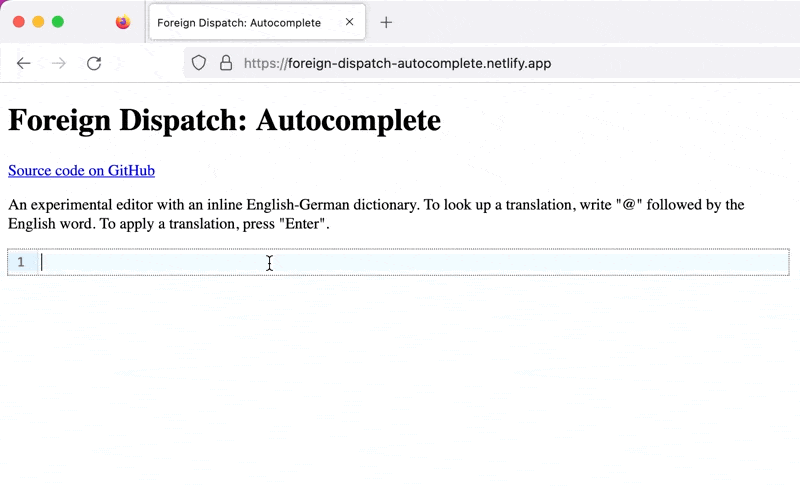

# Foreign Dispatch: Autocomplete

An experimental editor with an inline English-German dictionary. To look up
a translation, write "@" followed by the English word. To apply a translation,
press "Enter". [Try it here](https://foreign-dispatch-autocomplete.netlify.app/).



## Development

1. Download [WikDict](https://www.wikdict.com/) database:

   ```bash
   ./download-wikdict.sh
   ```

2. Install dependencies:

   ```bash
   npm install
   ```

3. Start the development server:

   ```bash
   npm run dev
   ```

## Publish

1. Build the project:

   ```bash
   npm run build
   ```

## Thanks

- [CodeMirror](https://codemirror.net/)
- [WikDict](https://www.wikdict.com/)
